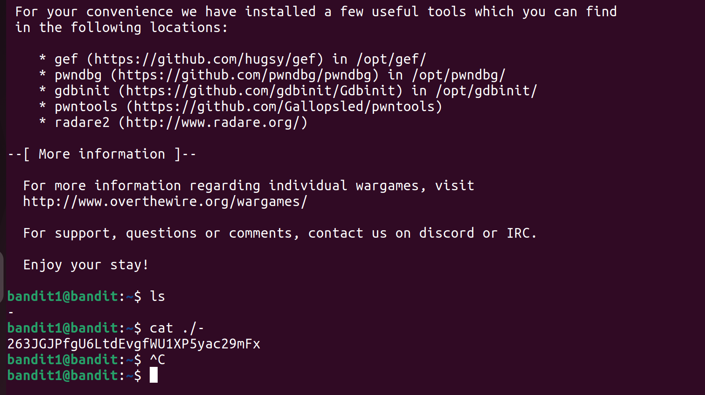

# Bandit Level 2 → Level 3

## Goal

Find the password for Bandit Level 3.

## Solution

First, I connected to the server using SSH.

```bash
ssh bandit2@bandit.labs.overthewire.org -p 2220
```

After entering the password for Bandit Level 2, I logged in successfully.

Next, I checked the files in the directory:

```bash
ls
```

There was a file with a space in its name:

```text
spaces in this filename
```

When a file has spaces, normal `cat` will not work because the terminal treats each word as a separate argument.

So I used quotes to handle the space properly:

```bash
cat "spaces in this filename"
```

### Explanation

- Quotes `""` are used to treat the whole filename as one single string.
- This is useful when file names contain spaces.

The command displayed the password for Bandit Level 3.

## Screenshot



## Commands Used

```bash
ssh bandit2@bandit.labs.overthewire.org -p 2220
ls
cat "spaces in this filename"
```

## Result

Successfully found the password for Bandit Level 3.
