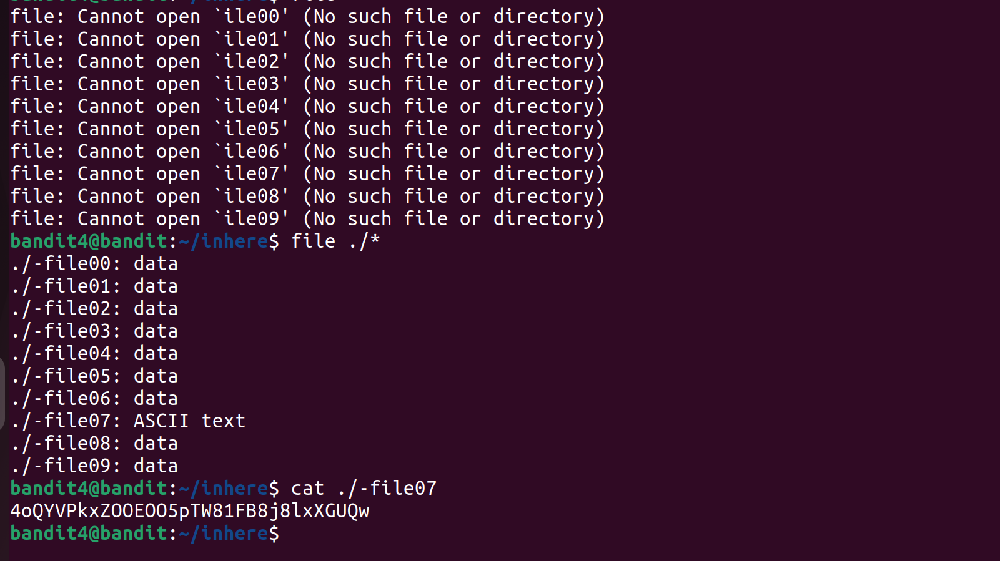

# Bandit Level 4 → Level 5

## Goal

Find the password for Bandit Level 5.

## Solution

First, I connected to the server using SSH.

```bash
ssh bandit4@bandit.labs.overthewire.org -p 2220
```

After entering the password for Bandit Level 4, I logged in.

## Step 1: Go to the directory

I checked the files:

```bash
ls
```

There was a directory named:

```text
inhere
```

I moved into it:

```bash
cd inhere
```

## Step 2: Check file types

Inside the directory, there were many files with unknown names.

To identify file types, I used the `file` command:

```bash
file ./*
```

### Explanation

- `file` tells what type of file it is (text, binary, etc.)
- `*` means all files in the directory
- `./*` ensures it checks files in the current directory

## Step 3: Find the correct file

Most files were shown as **data**, but one file was different:

```text
ASCII text
```

That file was the correct one.

## Step 4: Read the file

I used `cat` to read it:

```bash
cat ./<filename>
```

This showed the password for Bandit Level 5.

## Screenshot



## Commands Used

```bash
ssh bandit4@bandit.labs.overthewire.org -p 2220
ls
cd inhere
file ./*
cat ./<correct-file>
```

## Result

Successfully found the password for Bandit Level 5.
