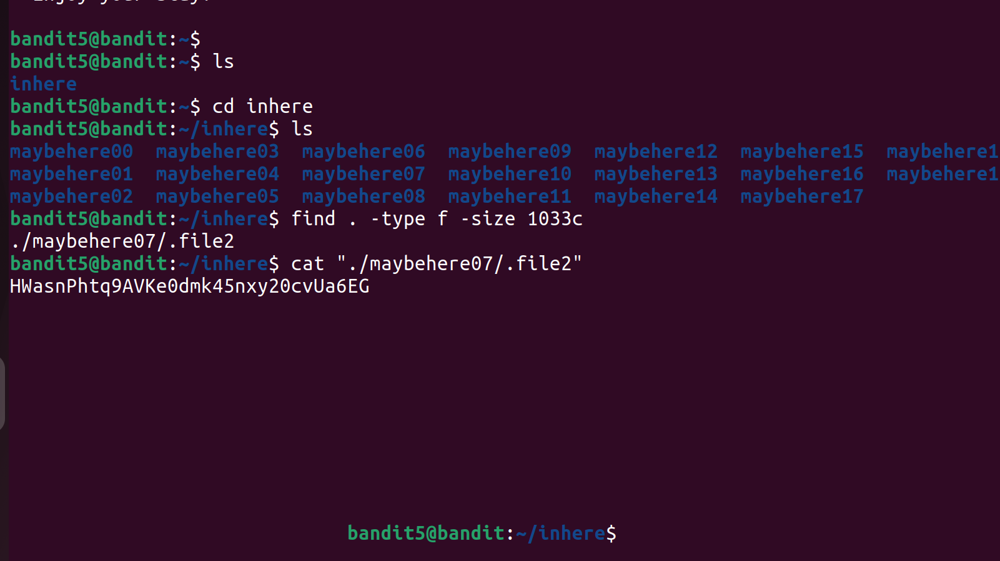

# Bandit Level 5 → Level 6

## Goal

Find the password for Bandit Level 6.

## Solution

First, I connected to the server using SSH.

```bash
ssh bandit5@bandit.labs.overthewire.org -p 2220
```

After entering the password for Bandit Level 5, I logged in.

## Step 1: Go to the directory

I checked the files:

```bash
ls
```

There was a directory named:

```text
inhere
```

I moved into it:

```bash
cd inhere
```

## Step 2: Find the correct file

Inside this directory, there are many subdirectories and files. The task is to find:

- Human-readable file  
- Size is **1033 bytes**  
- Not executable  

So I used the `find` command:

```bash
find . -type f -size 1033c ! -executable
```

### Explanation

- `.` → current directory  
- `-type f` → only files  
- `-size 1033c` → file size is 1033 bytes  
- `! -executable` → not executable file  

## Step 3: Open the file

The command returned the correct file path. Then I read it using:

```bash
cat ./<file-name>
```

This displayed the password for Bandit Level 6.

## Screenshot



## Commands Used

```bash
ssh bandit5@bandit.labs.overthewire.org -p 2220
ls
cd inhere
find . -type f -size 1033c ! -executable
cat ./<file>
```

## Result

Successfully found the password for Bandit Level 6.
